# 🚀 Luồng Auto Deploy (Git + ArgoCD) - Dev Portal Service

## 📋 Tổng quan

Dev Portal Service cung cấp tính năng **Auto Deploy hoàn toàn tự động** từ code → Git → Docker → ArgoCD → Kubernetes. Người dùng chỉ cần điền form, hệ thống sẽ tự động:

1. ✅ Generate Django project
2. ✅ Tạo Repository_A và push code
3. ✅ Setup GitHub Actions CI/CD
4. ✅ Build & push Docker image
5. ✅ Generate K8s manifests
6. ✅ Push manifests vào Repository_B
7. ✅ ArgoCD tự động deploy

---

## 🔄 Luồng hoạt động chi tiết

### 📊 Sequence Diagram
sequenceDiagram
    participant User as 👤 User
    participant Portal as 🌐 Dev Portal
    participant GitHub as 🐙 GitHub API
    participant RepoA as 📦 Repository_A<br/>(Django App)
    participant Actions as ⚙️ GitHub Actions
    participant GHCR as 📦 GHCR<br/>(Docker Registry)
    participant RepoB as 📂 Repository_B<br/>(K8s Manifests)
    participant ArgoCD as 🔄 ArgoCD
    participant K8s as ☸️ Kubernetes

    %% Step 1: User Request
    User->>Portal: POST /api/generate-and-deploy<br/>(ProjectConfig + GitHub Token)
    activate Portal
    
    %% Step 2: Generate Project
    Portal->>Portal: Generate Django Project Files<br/>(models, views, Dockerfile, CI/CD)
    Note over Portal: ProjectGenerator.generate_all_files()
    
    %% Step 3: Create Repository_A
    Portal->>GitHub: Create Repository_A
    GitHub-->>Portal: Repository created
    
    %% Step 4: Add Secret (CRITICAL!)
    Portal->>GitHub: Add PAT_TOKEN secret
    Note over GitHub: Secret required for<br/>Repository_B access
    GitHub-->>Portal: Secret added ✅
    
    %% Step 5: Push Code
    Portal->>RepoA: Push all files (batch commit)
    Note over RepoA: git push origin main<br/>(1 commit với tất cả files)
    
    %% Step 6: GitHub Actions Auto-Trigger
    RepoA->>Actions: 🔥 Workflow triggered<br/>(on push to main)
    activate Actions
    
    %% Step 7: Test
    Actions->>Actions: Step 1: Test Django code
    Note over Actions: Django import check<br/>Models/Views validation
    
    %% Step 8: Build Docker
    Actions->>Actions: Step 2: Build Docker image
    Actions->>GHCR: Push image to GHCR<br/>(ghcr.io/user/repo:latest)
    GHCR-->>Actions: Image pushed ✅
    
    %% Step 9: Update Repository_B
    Actions->>RepoB: Step 3: Update K8s manifests<br/>(apps/<app-name>/deployment.yaml)
    Note over RepoB: Update image tag<br/>Update timestamp (force restart)
    RepoB-->>Actions: Manifests updated ✅
    
    Actions-->>Portal: Workflow completed ✅
    deactivate Actions
    
    %% Step 10: Generate K8s Manifests
    Portal->>Portal: Generate K8s Manifests<br/>(namespace, deployment, service, etc.)
    Note over Portal: K8sManifestsGenerator.generate_all()
    
    %% Step 11: Push Manifests to Repository_B
    Portal->>RepoB: Push manifests to apps/<app-name>/
    Note over RepoB: Multi-app structure:<br/>apps/django-api/<br/>apps/app-2/<br/>apps/app-n/
    RepoB-->>Portal: Manifests pushed ✅
    
    Portal-->>User: ✅ Deployment initiated!
    deactivate Portal
    
    %% Step 12: ArgoCD Auto-Deploy
    Note over ArgoCD,RepoB: ArgoCD monitors Repository_B
    
    ArgoCD->>RepoB: Detect new app in apps/<app-name>/
    activate ArgoCD
    ArgoCD->>ArgoCD: ApplicationSet creates Application
    Note over ArgoCD: Auto-create from pattern:<br/>apps/*/
    
    ArgoCD->>K8s: Deploy to namespace <app-name>
    activate K8s
    K8s->>K8s: Create namespace
    K8s->>K8s: Apply manifests
    K8s->>K8s: Start pods
    K8s-->>ArgoCD: Deployment successful ✅
    deactivate K8s
    
    ArgoCD-->>User: 🎉 Application deployed!
    deactivate ArgoCD
    
    %% Step 13: Continuous Monitoring
    Note over ArgoCD,GHCR: ArgoCD Image Updater<br/>monitors for new images
    
    loop Every 2 minutes
        ArgoCD->>GHCR: Check for new image tags
        GHCR-->>ArgoCD: New tag detected?
        alt New image available
            ArgoCD->>RepoB: Update deployment.yaml
            ArgoCD->>K8s: Sync & Deploy
        end
    end
---

## 🔧 Chi tiết các bước

### 1️⃣ **User Request (POST /api/generate-and-deploy)**

**Input:**
```json
{
  "project_config": {
    "project_name": "django_api",
    "app_name": "api",
    "github_username": "yourusername",
    "docker_registry": "ghcr.io",
    "models": [...],
    "enable_cors": true,
    "enable_cicd": true,
    "repo_b_url": "https://github.com/user/Repository_B.git"
  },
  "github_token": "ghp_xxxxx",
  "repo_a_name": "django-api",
  "repo_b_name": "Repository_B",
  "create_new_repo_a": true,
  "auto_push_repo_b": true
}
```

**Endpoint:** `POST /api/generate-and-deploy`  
**File:** `main.py:1306-1573`

---

### 2️⃣ **Generate Django Project**

**Module:** `ProjectGenerator` (`main.py:71-941`)

**Generated files:**
- `manage.py`
- `requirements.txt`
- `Dockerfile`
- `<app_name>/models.py`
- `<app_name>/views.py`
- `<app_name>/serializers.py`
- `<app_name>/urls.py`
- `<project_name>/settings.py`
- `<project_name>/urls.py`
- `<project_name>/wsgi.py`
- `.github/workflows/ci-cd.yml` (nếu enable_cicd=true)
- `README.md`
- `.gitignore`

**Key functions:**
- `generate_models_py()` - Generate Django models
- `generate_views_py()` - Generate DRF views
- `generate_serializers_py()` - Generate DRF serializers
- `generate_dockerfile()` - Generate Dockerfile
- `generate_github_workflow()` - Generate CI/CD workflow

---

### 3️⃣ **Create Repository_A & Add Secret**

**Module:** `GitHubManager` (`github_manager.py`)

#### 3.1 Create Repository
```python
def create_repository(repo_name, description, private):
    # POST /user/repos
    # Creates new GitHub repository
```

#### 3.2 Add PAT_TOKEN Secret (CRITICAL!)
```python
def add_repository_secret(repo_name, secret_name="PAT_TOKEN", secret_value):
    # Encrypt secret using repository public key
    # PUT /repos/{owner}/{repo}/actions/secrets/{secret_name}
```

**⚠️ Important:** Secret phải được add TRƯỚC KHI push workflow file!

---

### 4️⃣ **Push Code to Repository_A**

**Method:** Batch Push (1 commit cho tất cả files)

```python
def push_files_batch(repo_name, files, commit_message):
    # 1. Get latest commit SHA
    # 2. Create tree với tất cả files
    # 3. Create commit
    # 4. Update branch reference
    # → Kết quả: 1 commit = 1 workflow run ✅
```

**Fallback:** Nếu batch push thất bại → Individual push (nhiều commits)

**File:** `github_manager.py:89-175`

---

### 5️⃣ **GitHub Actions Workflow (Auto-Triggered)**

**Trigger:** `on: push: branches: [main]`

**File:** `.github/workflows/ci-cd.yml`

#### Job 1: Test
```yaml
- Run Django tests
- Validate imports
- Check Django setup
```

#### Job 2: Build & Push
```yaml
- Build Docker image
- Push to GHCR (ghcr.io/user/repo:latest)
- Multi-platform: linux/amd64,linux/arm64
```

#### Job 3: Update Manifests
```yaml
- Checkout Repository_B (using PAT_TOKEN secret)
- Update apps/<app-name>/deployment.yaml:
  → Update image tag
  → Update timestamp (force restart)
- Commit & push [skip ci]
```

**Generated by:** `ProjectGenerator.generate_github_workflow()` (`main.py:364-744`)

---

### 6️⃣ **Wait for Workflow Completion**

**Module:** `GitHubManager.wait_for_workflow_completion()`

```python
def wait_for_workflow_completion(repo_name, workflow_file, timeout=600):
    # Poll workflow status every 10 seconds
    # Max timeout: 10 minutes
    # Returns: success | error | timeout
```

**File:** `github_manager.py:562-615`

---

### 7️⃣ **Verify Repository_B Updated**

**Module:** `GitHubManager.verify_repository_b_updated()`

```python
def verify_repository_b_updated(repo_b_name, app_name):
    # Check latest commit from GitHub Actions
    # Verify deployment.yaml updated
    # Extract image tag
```

**File:** `github_manager.py:471-560`

---

### 8️⃣ **Generate K8s Manifests**

**Module:** `K8sManifestsGenerator` (`k8s_generator.py`)

**Generated manifests:**
- `namespace.yaml` - Namespace riêng cho app
- `deployment.yaml` - Deployment với Image Updater annotations
- `service.yaml` - ClusterIP Service
- `pvc.yaml` - Persistent Volume Claim (1Gi)
- `ingress.yaml` - Nginx Ingress
- `kustomization.yaml` - Kustomize config
- `README.md` - Documentation

**Key features in deployment.yaml:**
```yaml
metadata:
  annotations:
    argocd-image-updater.argoproj.io/image-list: app=ghcr.io/user/repo
    argocd-image-updater.argoproj.io/write-back-method: git
    argocd-image-updater.argoproj.io/write-back-target: apps/app/deployment.yaml
    argocd-image-updater.argoproj.io/app.update-strategy: latest
```

**File:** `k8s_generator.py:431-454`

---

### 9️⃣ **Push Manifests to Repository_B**

**Module:** `GitHubManager.update_repository_b_manifests()`

**Structure:**
```
Repository_B/
├── apps/
│   ├── django-api/          # App 1
│   │   ├── namespace.yaml
│   │   ├── deployment.yaml
│   │   ├── service.yaml
│   │   └── ...
│   ├── django-api-staging/  # App 2
│   └── app-n/               # App N
├── k8s/
│   ├── applicationset.yaml  # Auto-creates Applications
│   └── ...
└── monitoring/
```

**Skipped files:**
- `argocd-application.yaml` - ApplicationSet tự tạo
- `argocd-image-updater-config.yaml` - Không cần
- `README.md` - Documentation only

**File:** `github_manager.py:330-380`

---

### 🔟 **ArgoCD Auto-Deploy**

#### Step 1: ApplicationSet Detects New App
```yaml
apiVersion: argoproj.io/v1alpha1
kind: ApplicationSet
spec:
  generators:
  - git:
      repoURL: https://github.com/user/Repository_B
      directories:
      - path: apps/*
```

**Result:** ApplicationSet tạo ArgoCD Application cho mỗi folder trong `apps/`

#### Step 2: ArgoCD Syncs
```bash
# ArgoCD Application được tạo tự động
kubectl get app django-api -n argocd

# ArgoCD sync manifests
# Deploy vào namespace django-api
```

#### Step 3: Kubernetes Deploy
```bash
# Create namespace
# Apply manifests
# Start pods (với initContainer setup)
# Expose Service
# Configure Ingress
```

---

## 🔄 Continuous Deployment Flow

### ArgoCD Image Updater


**Process:**
1. Developer pushes code → GitHub Actions
2. GitHub Actions builds new image → GHCR
3. ArgoCD Image Updater detects new tag (every 2 minutes)
4. Updates `deployment.yaml` in Repository_B
5. ArgoCD auto-syncs
6. Kubernetes performs rolling update

---

## 📂 Repository Structure

### Repository_A (Django App)
```
django-api/
├── .github/workflows/
│   └── ci-cd.yml         # Auto-generated CI/CD
├── api/                  # Django app
│   ├── models.py
│   ├── views.py
│   ├── serializers.py
│   └── urls.py
├── django_api/           # Django project
│   ├── settings.py
│   ├── urls.py
│   └── wsgi.py
├── Dockerfile            # Multi-stage build
├── requirements.txt
├── manage.py
└── README.md
```

### Repository_B (K8s Manifests)
```
Repository_B/
├── apps/
│   └── django-api/       # Generated by Dev Portal
│       ├── namespace.yaml
│       ├── deployment.yaml
│       ├── service.yaml
│       ├── pvc.yaml
│       ├── ingress.yaml
│       ├── kustomization.yaml
│       └── README.md
├── k8s/
│   ├── applicationset.yaml
│   └── django-api-staging-app.yaml
└── monitoring/
    └── grafana/
        └── configmap-custom-dashboard.yaml
```

---

## 🔑 Key Components

### 1. ProjectGenerator (`main.py`)
- Generate Django project files
- Generate Dockerfile
- Generate GitHub Actions workflow
- Generate README

### 2. GitHubManager (`github_manager.py`)
- Create GitHub repositories
- Add repository secrets
- Push files (batch/individual)
- Monitor workflow status
- Update Repository_B manifests

### 3. K8sManifestsGenerator (`k8s_generator.py`)
- Generate K8s manifests
- Configure ArgoCD annotations
- Setup Image Updater
- Multi-app structure support

### 4. GitHub Actions Workflow
- Test Django code
- Build Docker image
- Push to GHCR
- Update Repository_B manifests

### 5. ArgoCD ApplicationSet
- Auto-detect apps in `apps/*/`
- Create Applications
- Manage deployments

### 6. ArgoCD Image Updater
- Monitor Docker registry
- Detect new images
- Update manifests
- Trigger auto-sync

---

## ⚡ Optimizations

### Batch Push (1 Commit)
**Before:** Individual commits
- 15 files = 15 commits = 15 workflow runs ❌

**After:** Batch push
- 15 files = 1 commit = 1 workflow run ✅

**Implementation:** Git Tree API (`github_manager.py:89-175`)

### Secret Management
- Add PAT_TOKEN **before** pushing workflow
- Ensures GitHub Actions has access to Repository_B
- Auto-encrypted using repository public key

### Workflow Optimization
- Conditional steps with `if: github.ref == 'refs/heads/main'`
- Multi-platform Docker build (amd64, arm64)
- Build cache with GitHub Actions cache
- Skip CI commits: `[skip ci]`

---

## 🎯 Success Flow Summary

```mermaid
graph TD
    A[👤 User fills form] --> B[🌐 Dev Portal generates project]
    B --> C[📦 Create Repository_A]
    C --> D[🔑 Add PAT_TOKEN secret]
    D --> E[📤 Push code - 1 commit]
    E --> F[⚙️ GitHub Actions triggered]
    F --> G[🧪 Test Django code]
    G --> H[🐳 Build Docker image]
    H --> I[📦 Push to GHCR]
    I --> J[📝 Update Repository_B]
    J --> K[✅ Workflow completed]
    K --> L[📂 Portal pushes manifests]
    L --> M[🔄 ApplicationSet creates App]
    M --> N[☸️ ArgoCD deploys to K8s]
    N --> O[🎉 Application running!]
    
    style A fill:#e1f5fe
    style O fill:#c8e6c9
    style F fill:#fff9c4
    style M fill:#f3e5f5
```



---

## 📊 Monitoring & Access

### ArgoCD UI
```bash
kubectl port-forward svc/argocd-server -n argocd 8090:443
# https://localhost:8090
# Username: admin
# Password: kubectl -n argocd get secret argocd-initial-admin-secret -o jsonpath='{.data.password}' | base64 -d
```

### Grafana Dashboard
```bash
kubectl port-forward svc/grafana-service -n monitoring 3000:3000
# http://localhost:3000
# Username: admin
# Password: admin123
```

### Application Status
```bash
# ArgoCD Application
kubectl get app django-api -n argocd -w

# Kubernetes Pods
kubectl get pods -n django-api -w

# Application Logs
kubectl logs -n django-api deployment/django-api -f

# Image Updater Logs
kubectl logs -n argocd deployment/argocd-image-updater -f
```

---

## 🐛 Troubleshooting

### 1. Workflow không chạy
```bash
# Check workflow runs
gh run list --repo user/repo-a

# View workflow logs
gh run view <run-id> --log
```

### 2. Secret không tồn tại
```bash
# List secrets
gh secret list --repo user/repo-a

# Add secret manually
gh secret set PAT_TOKEN --repo user/repo-a
```

### 3. ArgoCD không sync
```bash
# Force hard refresh
kubectl patch app django-api -n argocd \
  -p '{"metadata":{"annotations":{"argocd.argoproj.io/refresh":"hard"}}}' \
  --type merge

# Check sync status
kubectl describe app django-api -n argocd
```

### 4. Image Updater không update
```bash
# Check Image Updater logs
kubectl logs -n argocd deployment/argocd-image-updater -f

# Verify annotations in deployment
kubectl get deployment django-api -n django-api -o yaml | grep argocd-image-updater
```

---

## 📚 References

### Code Files
- **Main API:** `main.py:1306-1573` - `/api/generate-and-deploy` endpoint
- **Project Generator:** `main.py:71-941` - Django project generation
- **GitHub Manager:** `github_manager.py` - GitHub API interactions
- **K8s Generator:** `k8s_generator.py` - K8s manifests generation

### Documentation
- [ArgoCD Documentation](https://argo-cd.readthedocs.io/)
- [ArgoCD Image Updater](https://argocd-image-updater.readthedocs.io/)
- [GitHub Actions](https://docs.github.com/en/actions)
- [Kustomize](https://kustomize.io/)

---

## 🎉 Conclusion

Dev Portal Service cung cấp **luồng Auto Deploy hoàn toàn tự động** với:

✅ **Zero Manual Steps** - Chỉ cần điền form  
✅ **GitOps Workflow** - Git là single source of truth  
✅ **Continuous Deployment** - Auto-update khi có image mới  
✅ **Multi-App Support** - Deploy nhiều apps song song  
✅ **Production Ready** - Rolling updates, health checks, monitoring  

**Generated by:** Django Dev Portal v1.0.0  
**Last Updated:** 2025-10-13

